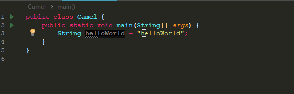
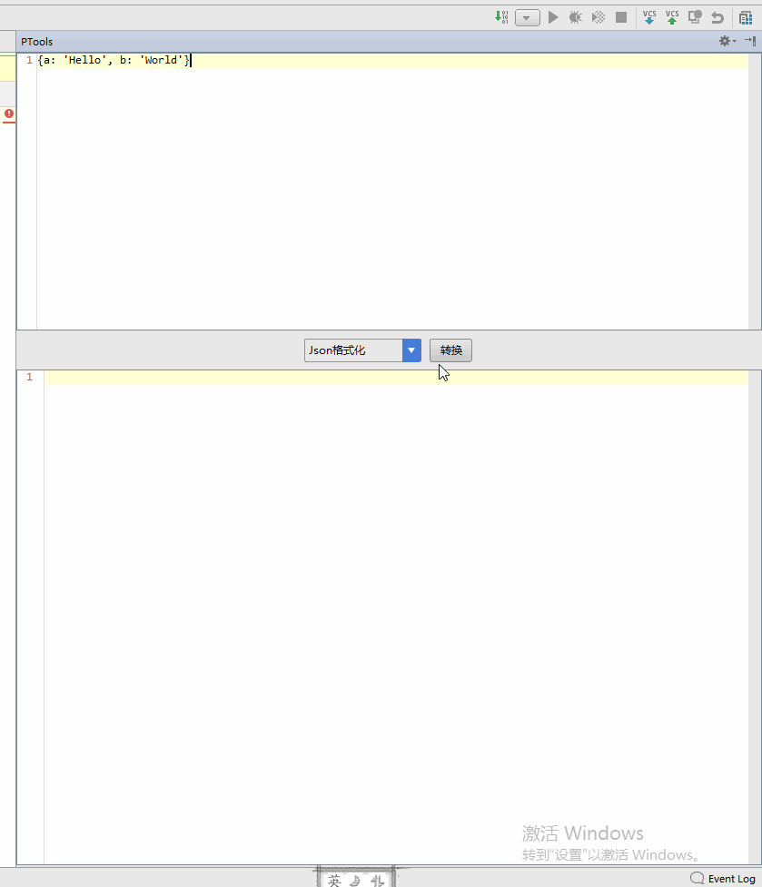
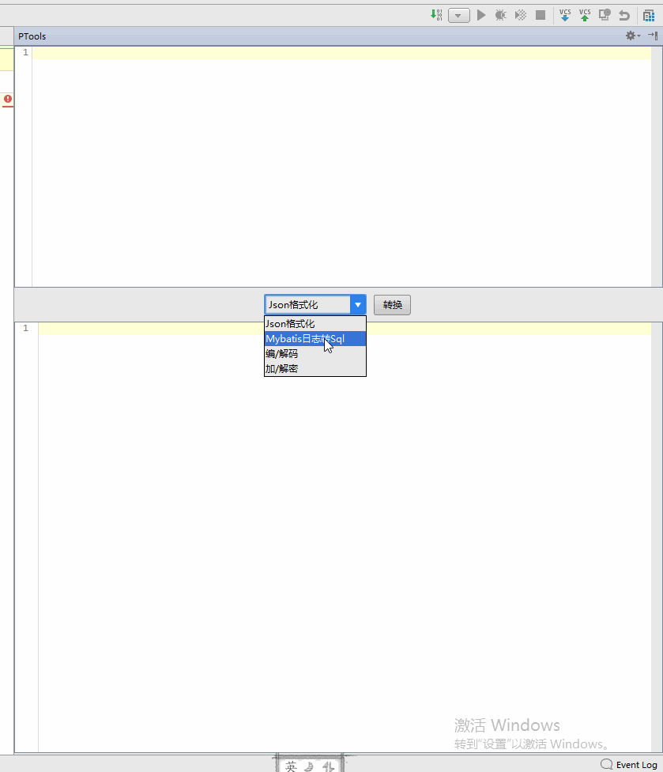
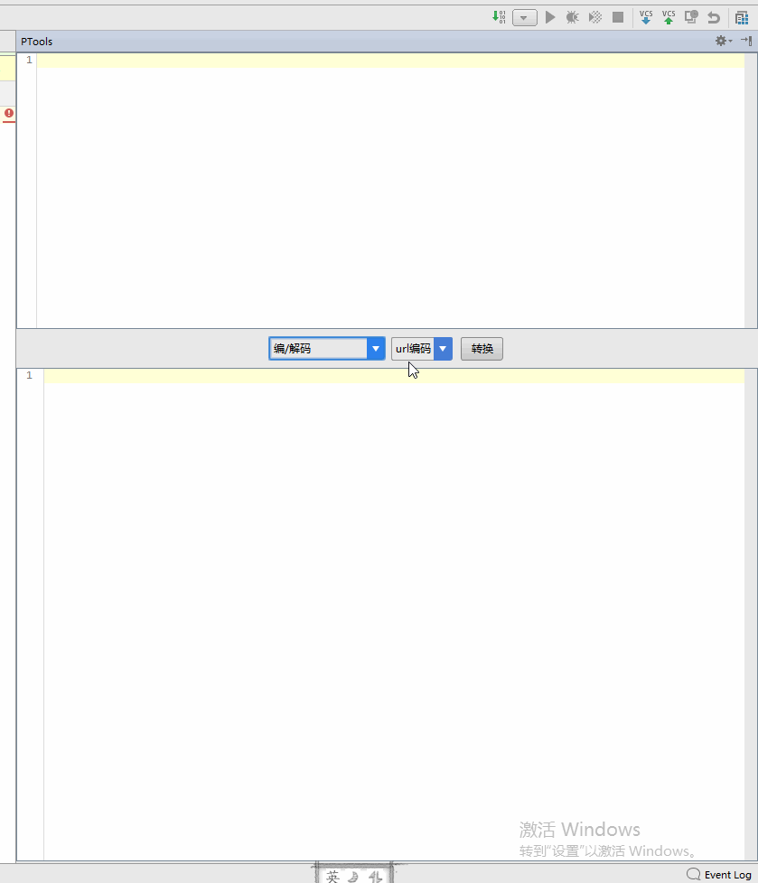
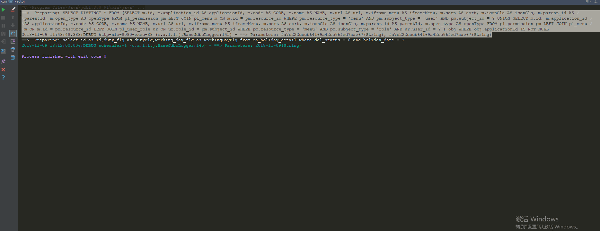
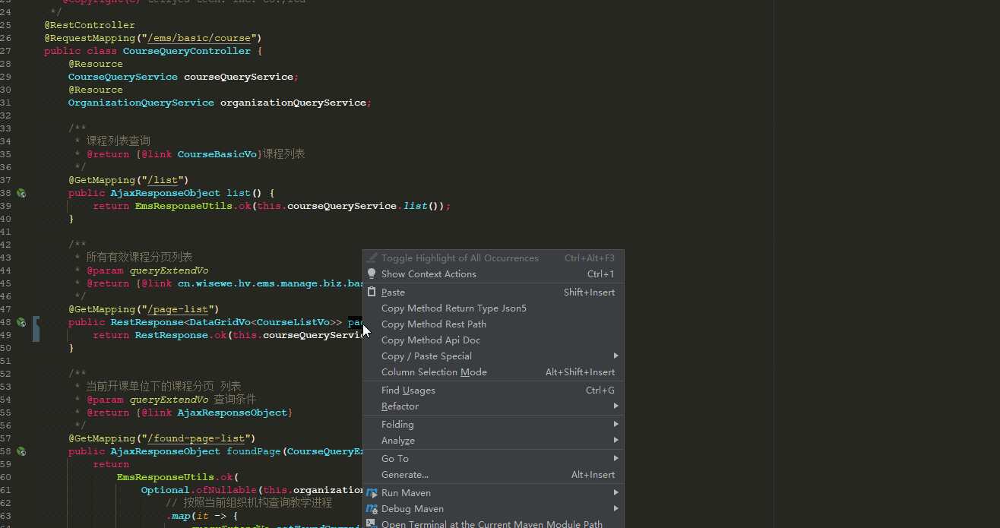
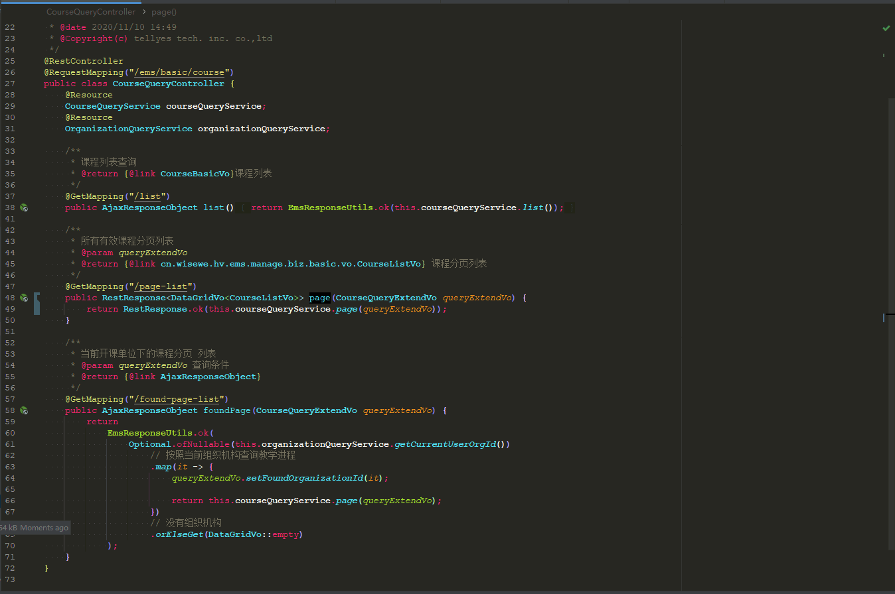
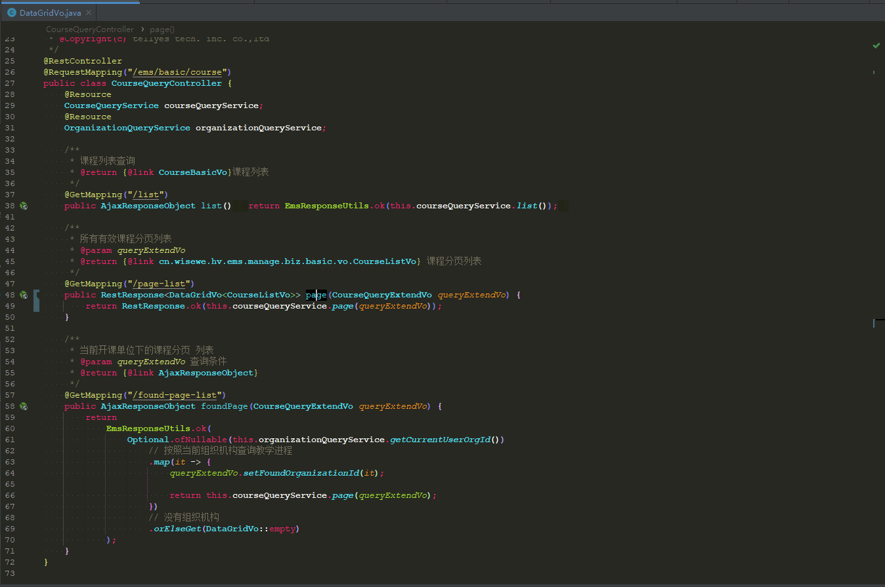
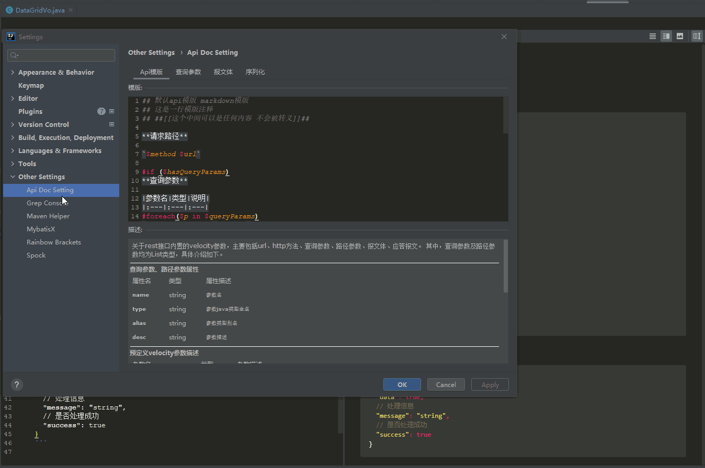

# idea-passerr-plugin 

- 离线安装  
[gitee下载](https://gitee.com/PasseRR/idea-passerr-plugin/releases)
最新zip直接安装或者
[插件市场](https://plugins.jetbrains.com/plugin/17350-passerr-idea-tools)
下载安装
  
- 在线安装  
  plugin中搜索`PasseRR`直接安装

## 1.命名切换

在CamelCase, camelCase, snake_case and SNAKE_CASE之间 默认快捷键`Alt + Shift + U`  

## 2.格式化窗口

右侧的ToolWindow有一个叫PTools的窗口   
分为上下两个文本域，上边为输入文本域，下边为输出文本域，中间为工具菜单及转换按钮   
点开可以进行json格式化、mybatis日志格式化为可执行sql、url编码解码、base64加解密、md5加密   
转换在输入文本域中快捷键为`Ctrl + Enter`

* Json格式化  
  

* Mybatis日志格式化  
  

* 编码解码/加密解密
  

## 3.Console栏直接复制mybatis日志为可执行的sql

注：复制的mybatis日志必须包含`Preparing:`及`Parameters:`

## 4.Spring web相关

所有复制菜单需要在方法名上，具体参考示例

### 4.1 复制rest路径

### 4.2 复制返回类型为json5数据格式

### 4.3 复制rest接口文档

### 4.4 接口文档配置
api文档模版基于`velocity`具体自行官网，默认为markdown的模版
